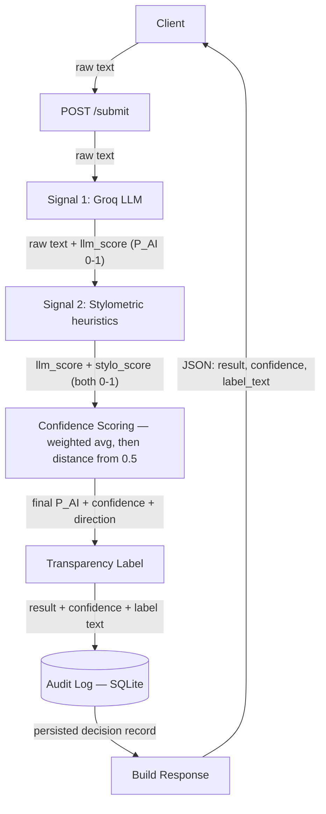
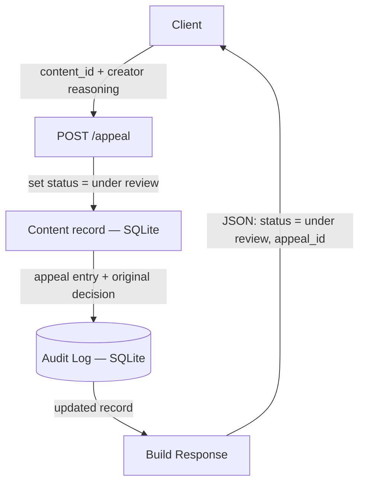

## Architecture

### Architecture Diagram

**Flow 1 — Submission (`POST /submit`)**

**Flow 2 — Appeal (`POST /appeal`)**

**Breakdown** In the submission flow, a client sends raw text to `POST /submit`; the text is scored independently by the Groq LLM signal and the stylometric heuristics, those two 0–1 scores are fused into a single `P(AI)` plus a confidence value, mapped to a transparency label, written to the audit log, and returned as JSON. In the appeal flow, a creator sends the `content_id` of a prior decision plus their reasoning to `POST /appeal`; the system flips that record's status to "under review", appends the appeal (linked to its original decision) to the audit log, and returns the updated status. Both flows converge on the same SQLite-backed audit log, which is the single source of truth that `GET /log` reads from.

**Content Submission Endpoint**
- This is the first part of the system. I build an API endpoint to accept a piece of text-based content (which can be a poem, a short story excerpt, a blog post) for attribution analysis. The endpoint must return a response containing the attribution result, a confidence score (human, AI, unsure), and a transparency label text that will be shown to the user. 

**Multi-Signal Detection Pipeline**
- *LLM-based classification (Groq)*: This detection signal will ask the model to assess whether the text reads as human or AI-generated. It captures semantic and stylistic coherence holistically. This signal resides on word association and sequence predictability, meaning that subtle humor, sarcasm, or overall nuanced text would contradict the actual semantic intent. Often times, LLM classifcations are biased towards answers that are long and verbose. Both will be addressed in this system.

- *Stylometric heuristics*: This next detection signal considers measurable properties that differ between human and AI writing. It combines three metrics into one P(AI) score (weighted): (1) **burstiness** — the coefficient of variation of sentence lengths; humans vary sentence length, AI is more uniform, so low variance leans AI; (2) **AI-phrase markers** — density of LLM-favored connectives/cliches ("furthermore", "it is important to note", "transformative", "stakeholders"); more markers leans AI; (3) **comma density** — commas per sentence; AI favors balanced, comma-rich constructions. The phrase-marker metric is weighted highest (0.6, vs 0.25 burstiness and 0.15 comma density) because it is the only one that separates clearly-AI prose from formal-but-human prose — burstiness alone wrongly ranks uniform human writing (e.g. academic text) as AI. I originally planned to use vocabulary diversity (type-token ratio) but dropped it after testing showed modern AI has lexical diversity as high as humans, so it did not discriminate. Some limitations remain: statistical reliance on sample size (short text falls back to a neutral 0.5), and domain/context dependency (an author's style fluctuates across academic/casual/email formats). These are mitigated by weighting the LLM signal higher in fusion.

Each signal independently outputs P(AI) ∈ [0,1] (LLM returns its estimate; stylometry maps its heuristics to a 0–1 score). Then, the
final P(AI) = weighted average. Thus, the LLM is the stronger holistic signal; stylometry is a cheaper sanity check. If both say "AI," the system is confident; if one says human and the other says AI, the sytem is unsure.

**Confidence Scoring With Uncertainty**
- My system will return a confidence score, not just a binary label. It will reflect genuine uncertainty. Because a 0.51 confidence should produce a meaningfully different transparency label than a 0.95, I separate the **direction** of the prediction from the **confidence** in it.

- *The axis*: The pipeline produces a single raw probability `P(AI)` in [0, 1], where 0.0 = clearly human and 1.0 = clearly AI. From this one number I derive two things:
  - **Direction** = which side of 0.5 the score is on (`< 0.5` leans human, `> 0.5` leans AI).
  - **Confidence** = how far the score is from 0.5, rescaled to a clean [0, 1]: `confidence = 2 * |P(AI) - 0.5|`. So `P(AI)=0.50` gives confidence 0.00 (maximum ambiguity), `P(AI)=0.75` gives confidence 0.50, and `P(AI)=0.95` or `0.05` gives confidence 0.90 (very sure). Confidence simply measures distance from the decision boundary, which keeps it monotonic and intuitive.

- *Asymetric Thresholds *: Because wrongly accusing a human writer of being AI is the more harmful error (the *false positive problem*, see Appeals Workflow), I make "AI" harder to declare than "human". The uncertain band is intentionally asymmetric:

  - `P(AI) <= 0.35` -> **confident human**
  - `P(AI) >= 0.75` -> **confident AI**
  - `0.35 < P(AI) < 0.75` -> **uncertain**

  These edges are starting values, tuned with the calibration data below, but the asymmetry (a wider buffer protecting humans from false AI accusations) is a deliberate, defensible policy choice rather than an arbitrary cutoff.

"How I tested whether your scores are meaningful*: 
- I built a tiny labeled eval set and a eval.py script:
~15–20 known-human texts (My writing and pre-2020 Project Gutenberg excerpts) + ~15–20 AI-generated ones (generate with Groq).
Also a handful of deliberately ambiguous cases (AI text lightly human-edited; very terse human text) — these should land in "uncertain." Then, I ran all through the pipeline and produce a calibration table: bucket predictions by confidence band (0.5–0.7, 0.7–0.85, 0.85–1.0) and compute accuracy per band. If higher-confidence buckets are more accurate, the system's scores are meaningful.

**Transparency Label**: 
- This part of the process designs and implements the label that would be displayed to a reader on the platform. It communicates the attribution result in plain language, and makes the the confidence level meaningful to a non-technical reader. It must include a typed description of all three label variants: *high-confidence AI, high-confidence human, uncertain*.

*High-confidence AI:*
- Shown when `P(AI) >= 0.75`. It will inform the user in plain english: *"We are confident this text is AI."*
*High-confidence human:*
- Shown when `P(AI) <= 0.35`. It will inform the user in plain english: *"We are confident this text is human."*
*Uncertain*
- Shown when `0.35 < P(AI) < 0.75`. It will inform the user in plain english: *"We are unable to make a confident decision at this time."*

**Appeals Workflow**: 
- This next part of the system includes a mechanism for creators to contest a classification. Only creators are allowed to submit an appeal, and the appeal should include the following information: original text excerpt, the decision + scores, and the creator's reasoning side by side. This is part of the *false positive problem*, where the system misclassifies a human writer's work for AI. It will capture the creator's reasoning, log the appeal alongside the original decision, and update the content's status to "under review". 

**Rate limiting**:
- This part of the system implements rate limiting on the endpoints. The key reasoning anchor is that **every submission triggers a Groq LLM call**, which has both cost and an upstream rate ceiling, so the limits protect cost and keep the system under Groq's own request-per-minute limits while blocking abuse.

**Anticipated Edge Cases**
- I anticipate that there will be content that gets missclassified, because as stated previously, the detection signals flag either semantics or structure. This means that content that is sarcastic or includes subtle humor, nuanced text, lack of sample size, and context dependent formats (emails, casual texts, academic papers) could be flagged as AI. 

| Endpoint | Limit | Reasoning |
|---|---|---|
| `POST /submit` | 10/min, 100/day per IP | Legit users analyze occasionally, not in bursts; 10/min allows interactive testing but blocks scrapers; 100/day caps daily LLM cost; stays under Groq free-tier RPM. |
| `POST /appeal` | 5/min per IP | Appeals are rare, deliberate human actions, so a low limit discourages spam. |
| `GET /log` | 30/min per IP | A cheap read with no LLM call, so it tolerates a higher limit. |

## AI Tool Plan

*M3 (submission endpoint + first signal):* 
- Which spec sections you'll provide to the AI tool (hint: your detection signals section + the diagram), what you'll ask it to generate (Flask app skeleton + the first signal function), and how you'll verify the output (test with a few inputs directly before wiring into the endpoint).

*M4 (second signal + confidence scoring):* 
- Which spec sections you'll provide (detection signals + uncertainty representation + diagram), what you'll ask for (second signal function + scoring logic), and what you'll check (do scores vary meaningfully between clearly AI and clearly human text?).

*M5 (production layer):* 
- Which spec sections you'll provide (label variants + appeals workflow + diagram), what you'll ask for (label generation logic + the /appeal endpoint), and how you'll verify (test all three label variants are reachable and that an appeal updates status correctly).